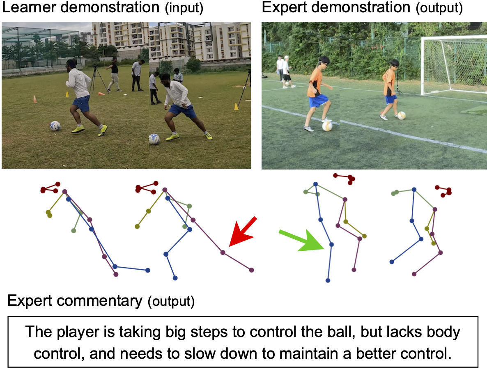

# ExpertAF: Expert Actionable Feedback from Video

Code implementation of CVPR 2025 paper 'ExpertAF: Expert Actionable Feedback from Video'.

[](https://arxiv.org/pdf/2408.00672.pdf)  [](https://vision.cs.utexas.edu/projects/ExpertAF/)



## Dataset and path

We create the following weakly-supervised training and testing data for ExpertAF.

[Train dataset](https://drive.google.com/file/d/1Lu7goQ_kUXQdt5JxJmHhcXbmG7_SQmtj/view?usp=sharing), [Test dataset](https://drive.google.com/file/d/1OowwsS3SfSVsinMyUaK0aVr1hyaNYs35/view?usp=sharing), [Parsed expert commentary](https://drive.google.com/file/d/1BpgBRU7ZnOBaCuHGyYmT4kEhquNnxs6p/view?usp=sharing)

Note that the data follows the format for LLaVA-style training.


## Installation and usage

This code is based on LLaVA (NeurIPS 2023). Please see installation instructions in the repo to setup the environment.

### Key architectural changes compared to LLaVA

- We create the training data in the same format as LLaVA, i.e., a list of samples with conversation-style format.
- Replaced `vision_tower` with an option to use pretrained pre-extracted features (helps reduce the parameter and avoids feature computation during train and test).
- Replaced `<image>` tag in LLaVA with `<pose1>` and `<pose2>` for learner and expert features (video and pose).

### Running the code

We use `slurm_hp_with_mover.sh` that runs the code in SLURM with hyper-parameter search. Set the variables correctly for the mode and run it. The script first copies the working directory to a destination path and then runs the code--ensuring a version of the code is saved along with the result.

The above code runs `pretrain_v15.sh` which can also be modified as per the dataset being tested and the input conditions.

Run the code with

```
sbatch -J name_of_the_run slurm_hp_with_mover.sh 
```


## Cite

```
@inproceedings{expertaf,
  title={ExpertAF: Expert actionable feedback from video},
  author={Ashutosh, Kumar and Nagarajan, Tushar and Pavlakos, Georgios and Kitani, Kris and Grauman, Kristen},
  booktitle={Proceedings of the Computer Vision and Pattern Recognition Conference},
  pages={13582--13594},
  year={2025}
}
```
